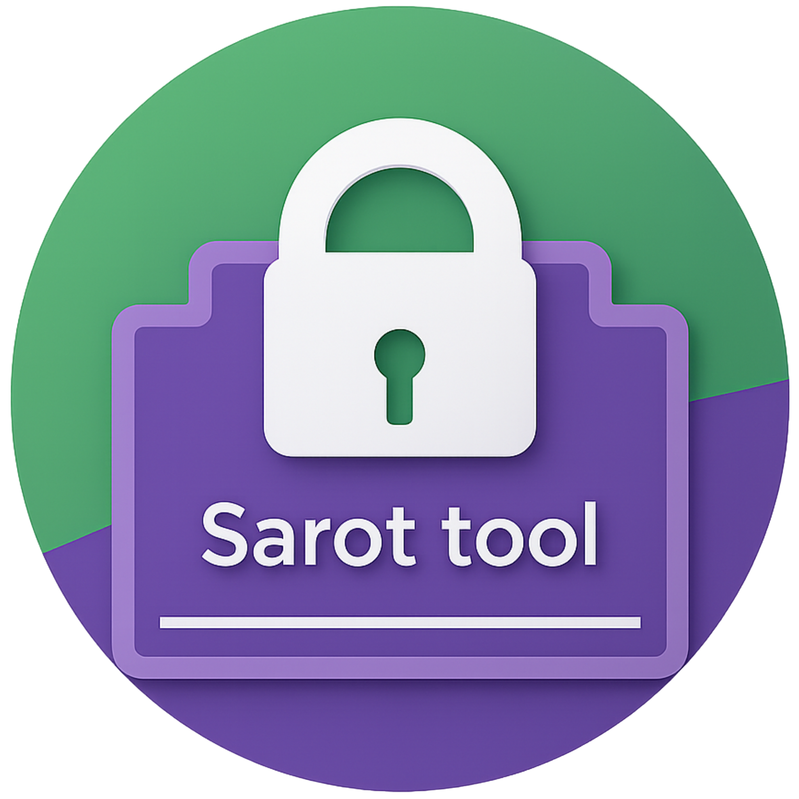
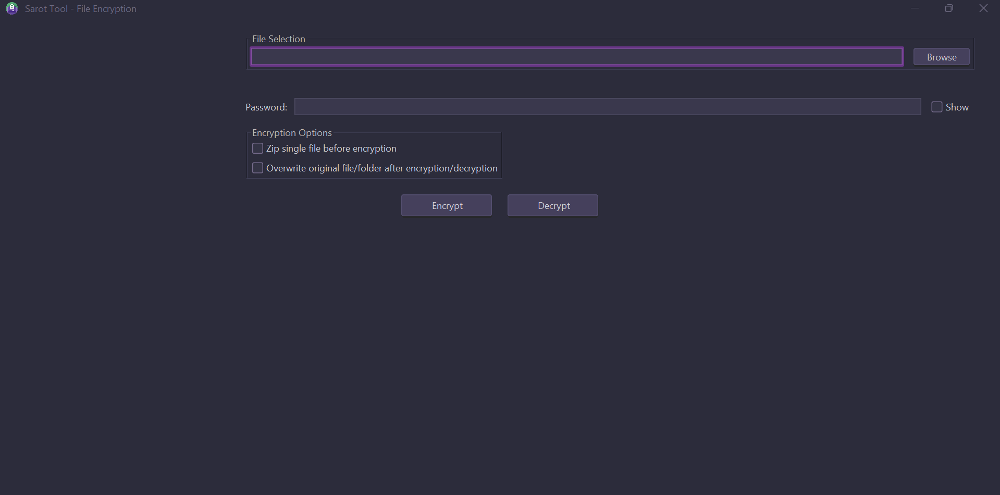

# SarotTool

<p align="center">
  
</p>

**SarotTool** is a modern, user-friendly desktop application for secure file/folder encryption and decryption. It uses strong AES-256 encryption, HMAC authentication, and supports zipping folders/files for convenient secure storage and sharing.



---

## Features

- **AES-256 Encryption**: Securely encrypts files and folders.
- **HMAC Authentication**: Detects tampering, wrong password, or non-SarotTool files.
- **Password Strength Validation**: Enforces strong password rules.
- **Zip Support**: Folders (and optionally files) are zipped before encryption for convenience.
- **Overwrite Option**: Optionally deletes original files/folders after encryption/decryption.
- **Modern UI**: Clean, intuitive interface with FlatLaf DarkPurple theme.
- **Windows Installer**: Professional installer with Start Menu and Desktop shortcuts.

---

## Getting Started

### Download

- **[Latest Release](https://github.com/Oumaima-Ab/Sarot-tool/releases/latest)**  
  Download the Windows installer (`SarotTool-1.0.0.exe`) from the [Releases](https://github.com/Oumaima-Ab/Sarot-tool/releases) page.

### Installation

1. Run the downloaded installer.
2. Follow the prompts to choose the installation directory.
3. Launch SarotTool from the Start Menu or Desktop shortcut.

---

## Usage

1. **Select a file or folder** to encrypt or decrypt.
2. **Enter a strong password** (must be 8-32 characters, with uppercase, lowercase, digit, and special character).
3. **Choose options**:
    - *Zip single file before encryption*: Zips files before encrypting (folders are always zipped).
    - *Overwrite original*: Deletes the original after operation.
4. Click **Encrypt** or **Decrypt**.
5. Progress and status messages will guide you.

> **Note:**  
> - Encrypted files are named with `_enc` suffix.  
> - Decrypted files restore the original name.

---

## Security

- **Encryption:** AES-256 in CBC mode with PBKDF2 key derivation and random salt/IV.
- **Authentication:** HMAC-SHA256 over IV and ciphertext.  
- **Tamper Detection:** If authentication fails, the app warns about possible corruption, wrong password, or non-SarotTool file.

---

## Building from Source

### Prerequisites

- Java 21+
- Gradle
- [WiX Toolset](https://wixtoolset.org/) (for Windows installer packaging)

### Steps

```sh
git clone https://github.com/Oumaima-Ab/Sarot-tool.git
cd Sarot-tool
./gradlew clean fatJar
./gradlew jpackage
```

- The installer (`SarotTool-1.0.0.exe`) will be created in the `build/jpackage/` directory by default.
- If you run `jpackage` manually or your configuration differs, check your project root or the specified output directory for the installer.

---

## License

This project is licensed under the [MIT License](LICENSE).

---

## Credits

- [FlatLaf](https://www.formdev.com/flatlaf/) for the modern UI theme.
- [Passay](https://www.passay.org/) for password validation.
- Java Standard Library for cryptography and zip utilities.

---

## Contributing

Pull requests and suggestions are welcome!  
Please open an issue to discuss your ideas or report bugs.

---

## Contact

**Author:** Oumaima Aboukhayyou  
**Email:** aboukhayyououmaima@gmail.com

---


## FAQ

**Q: What happens if I try to decrypt a file not encrypted by SarotTool?**  
A: The app will warn you that authentication failed, possibly due to a wrong password, file corruption, or the file not being encrypted by SarotTool.

**Q: Is my password stored anywhere?**  
A: No. Passwords are never stored or transmitted.

**Q: Can I use this on Mac or Linux?**  
A: The provided installer is for Windows. You can build from source for other platforms.

---
